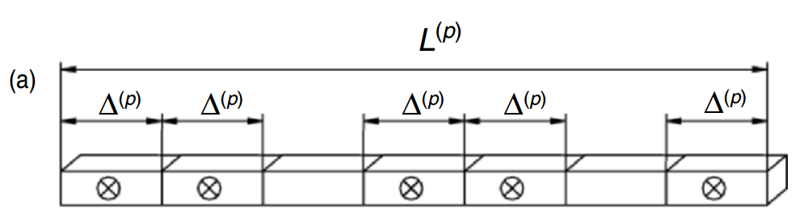
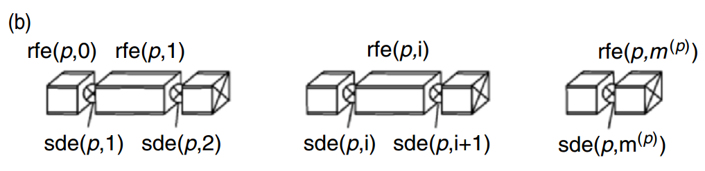
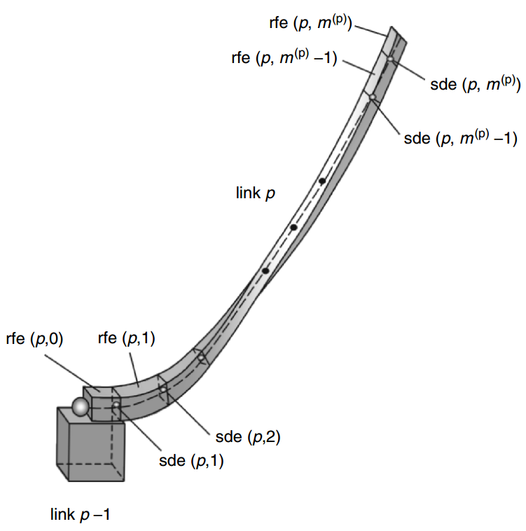
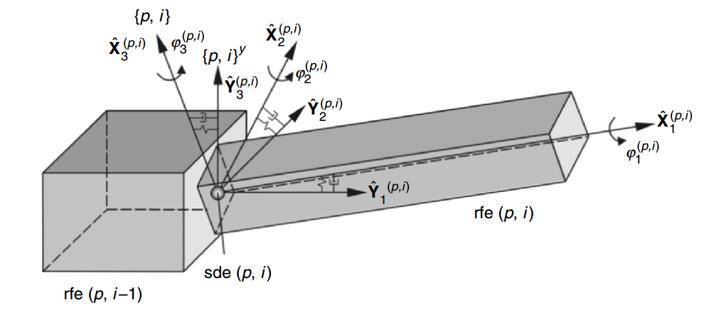
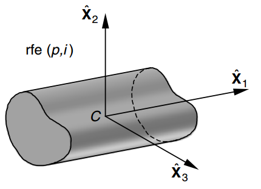

# The Rigid Finite Element Method

"The idea of the rigid finite element method is to discretise a system of many links, including flexible links, and replace it with a system consisting of rigid finite elements (rfes) which are connected with each other and with a base by means of spring–damping elements (sde)."

"Discretisation of the material continuum is carried out in two stages. First, the continuum is divided into relatively simple elements with finite dimension, and their spring and damping features are concentrated at one point (the sde is obtained in this way); this is called primary division (see figure below). In the secondary division, rfes are isolated between sdes from the primary division and in this way a system of rfes connected by sdes is obtained (see figure below)."

"The rigid finite element method in its classical formulation enables any displacements of rigid elements of the flexible link to be considered and thus all possible deformations (bending, torsion, shear and extension) to be analysed." The modified rigid finite element method only considers bending and torsional flexiblity and "displacements of each rfe are considered in relation to the preceding element". The modified approach can be used for large and bending deformation as well. 

Figure above presents a beam-like link $p$ with bending and torsional flexbility divided into $m^{(p)} + 1$ rfes and $m^{(p)}$ sdes. Consider rfe $(p, i-1)$ and rfe $(p, i)$ connected by a shperical joint at which sde $( p,i)$ is placed. The coordinate system $\{p, i\}^Y$ is assigned to each sde $(p, i)$ in such a way that its axes coincide with the principal axes of this spring-damping element. The position and orientation of the coordinate system $\{p, i\}^Y$ assigned to the sde are constant with respect to the coordinate system assigned to rfe $(p, i − 1)$ and are defined by the following transformation matrix
$$
T_{Y}^{(p,i)} = \begin{bmatrix} \Theta_{Y}^{(p,i)} & s_{Y}^{(p,i)} \\ 0 & 1  \end{bmatrix}
$$

where $\Theta_{Y}^{(p,i)}$ is the direction cosine matrix of the axes of the system $\{p, i\}^Y$ with respect to the axes of the coordinate system $\{p, i − 1\}$ assigned to rfe $(p, i − 1)$ and $s_{Y}^{(p,i)}$ is the coordinate vector of the origin of the coordinate
system $\{p, i\}^Y$ with respect to the coordinate system $\{p, i − 1\}$.

The coordinate system $\{p, i\}$ is assigned to rfe $(p, i)$ in such a way that its axes coincide with the principal axes of sde $(p, i)$ (which means that $\{p, i\} = \{p, i\}^Y$), when link $p$ is in an undeformed state. As a result of external loads and inertial forces rfe $(p, i)$ can rotate about a fixed point with respect to rfe $(p, i − 1)$. It can be assumed that the motion of rfe $(p, i)$ with respect to rfe $(p, i − 1)$ is defined by Euler angles ZYX as $\phi_3^{(p,i)}$, $\phi_2^{(p,i)}$, $\phi_1^{(p,i)}$ or $\phi^{(p,i)} = [\phi_1^{(p,i)}\ \phi_2^{(p,i)}\ \phi_3^{(p,i)}]$ 

Knowing homogenous transformations between rfes we can use Lagrange-Euler dynamics formulation or the Newton-Euler method to derive dynamics equations of motion. 

*Remark on potential energy of springs:* The method of assigning the coordinate systems $\{p,i\}$ results in a very simple form of expressions for the potential energy of spring deformation of
the sde and the function of energy dissipation
$$
V_s^{(p)} = \sum_{i=1}^{m^{(p)}} \sum_{j=1}^3 c_{\phi,j}^{(p,i)}[\phi_j^{(p,j)}]^{2} \\
W_s^{(p)} = \sum_{i=1}^{m^{(p)}} \sum_{j=1}^3 d_{\phi,j}^{(p,i)}[\dot \phi_j^{(p,j)}]^{2}
$$
where $c_{\phi,j}^{(p,i)}$ $(j = 1, 2, 3)$ are the coefficients of rotational stiffness of sde $(p, i)$ and $d_{\phi,j}^{(p,i)}$ $(j = 1, 2, 3)$ are the coefficients of rotational damping of sde $(p,i)$.

## Parameters of RFEs
"Basics parameters of an rfe are the mass and inertial moments" (mass, first and second moments of inertia); these parameters occur in the inertial matrix, Coriolis matrix and gravity torque vector. Those parameters are usually expressed in the local coordinate frame of a rfe. For homogenous beams with particular cross sections one can find ready to use equations; for complex shapes one has to take numerical integrals or extract inertial parameters from a CAD software.

<!--  -->

## Parameters of SDEs
"The basic parameters of the sde are values characterising spring and damping features. The coefficients of stiffness and damping of the sde, in which all such features of a beam segment with length ∆l are concentrated, are determined on the basis of the assumption that a real segment of the beam will deform in the same way and with the same velocities of deformation as the equivalent sde under the same load. " To derive equivalent spring and damper parameters one can use Kelvin-Voigt rheological model.  Again for simple shapes there are ready to use formulas; for complex shapes one has to leverage numerical tools. 

# Rigid body dynamics + modified RFEM

# MPC basics
Model Predictive Control (MPC) is an optimization based method for simultaneous trajectory planning and control. In continuous form it is often formulated as follows:
$$
\text{min}_{u} \int_{0}^{T} l(x(t),u(t))dt + V_T(x(T)) \\
\text{subject to} \qquad \qquad \qquad \qquad \qquad \qquad \\
\dot x = f(x, u) \\
g(x, u) = 0 \\
h(x, u) \leq 0
$$
where
* $\dot x = f(x, u)$ is a dynamic model of the system with $x$ being states of the system, and $u$ being control inputs;
* $g(x, u)$ equality constraints, for example, final position of the end-effector;
* $h(x, u)$ inequality constraints that include actuators limits, motor velocity and position limits and obstacles;
* $l(x, u)$ is an objective function; it might be an energy used by actuators or a distance to a final state of the robot.

At each sampling time MPC solves an optimization problem (that results in a sequence of inputs) and the only the first input is applied to the system. The advantage of MPC is that it takes into account contraints and optimizes certain objective function. In presence of constraints it also plans a motion that avoids obstacles.

# RL basics

# Combining MPC and RL